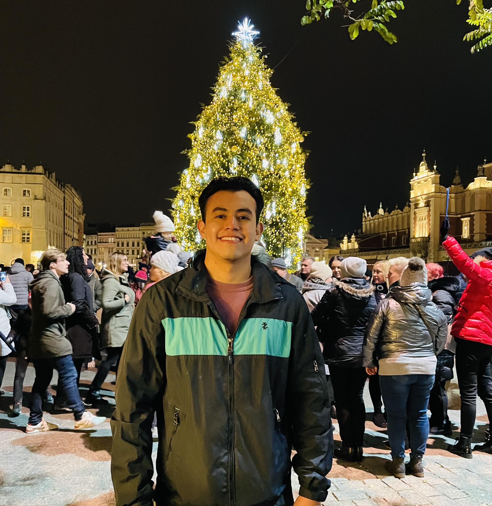

# reading-notes

Reading journal for class 102d45

Hello my name is **Rafael Aldana**, I'm a U.S ARMY veteran I've served my country for about seven years now. Over the last two or three years I have been working as contractor for the U.S NAVY and also as a nationalguardsmen on the side as well. I am looking forward for this career a little extra because I have no background in Software or TECH, so by doing this I can prove myself that I can accomplish anything I set my mind to.

Follow the link for my github portfolio: [link to my github](https://github.com/Rafael-Aldana) 

## READING NOTES TABLE OF CONTENTS

### CODE 102 READING-NOTES

1. [Class1](https://github.com/Rafael-Aldana/reading-notes/blob/main/102-Notes/Class1-Markdown-notes.md)
2. [Class2](Class2-Coder'sComputer-notes.md)
3. [Class3](Class3-RevisionsAndTheCloud-notes.md)
4. [Class4](Class4-StructureWebPagesWithHTML-notes.md)
5. [Clas5](Class5-DesignWebPagesWithCSS-notes.md)
6. [Class6](Class6-DynamicWebPagesWithJavaScript-notes.md)
7. [Class7](Class7-ProgrammingWithJavaScript-notes.md)
8. [Class8](Class8-OperatorsAndLoops-notes.md)

### CODE 201 READING-NOTES

1. [Class1](Class1notes.md)
2. [Class2](Class2notes.md)
3. [Class3](Class3notes.md)
4. [Class4](Class4notes.md)
5. [Class5](Class5notes.md)
6. [Class6](Class6notes.md)
7. [Class7](Class7notes.md)
8. [Class8](Class8notes.md)
9. [Class9](Class9notes.md)
10. [Class10](Class10notes.md)
11. [Class11](Class11notes.md)
12. [Class12](Class12notes.md)
13. [Class13](Class13notes.md)
14. [Class14](Class14notes.md)
15. [Class15](Class15notes.md)
